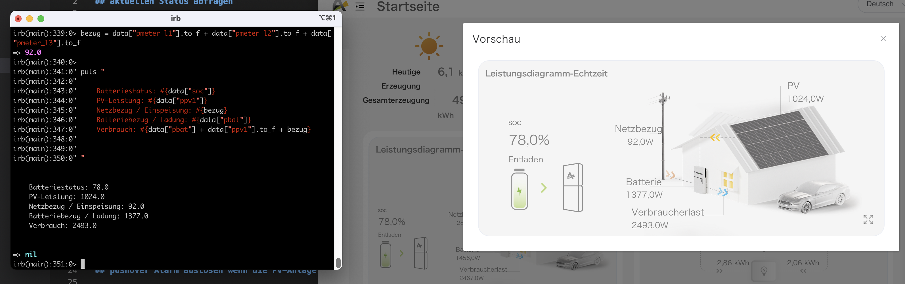

# Was haben wir hier?

API-Calls für Alpha Ess

Es gibt keine öffentliche Dokumentation zur aktuellen API von Alpha Ess. Ich habe den Netzwerkverkehr meines Browsers etwas unter die Lupe genommen und hier die entscheidenen Request nachgebaut.

# Abgrenzung

Ich übernehme keinerlei Haftung für die Verwendung dieses Ruby-Modules. Das Modul ist selbstgebaut und ist nur rudimentär getestet. Also alles komplett auf eigenes Risiko.

# Installation 

```bash
gem install alpha_ess
```

# Verwendung

## Umgebunsvariablen

Die verwendeten Umgebungsvariablen am besten in ein Textfile schreiben, wodrin die Variablen exportiert werden und dann das Textfile in der bash sourcen.

Vor der Ausführung des Ruby-Scriptes sollten folgende Umgebungsvariablen gesetzt werden:

### für Alpha Ess Api

ess_serial, ess_username und ess_password

Das Textfile mit dem Namen `ess_env` könnte also wie folgt aussehen:

```
export ess_serial=ABC000123
export ess_username=meine@email.de
export ess_password=mein_password
```

dann source mit 

```
. ./ess_env
```

### für optionale pushover notifications

po_user und po_token , beides über pushover Website einstellen. Pushover App gibt es für Smartphones und Tablets für einmalig 5 €.

Das Textfile mit dem Namen `po_env` könnte also wie folgt aussehen:

```
export po_token=sdfisdfoiodisosdifs
export po_user=dflgkdlkjneofifslkdnv
```

dann source mit 

```
. ./po_env
```

### Ablauf

Vor dem Start des Scripts beide Env-Files sourcen und dann das Ruby-Script mit dem gewünschten Code ausführen.

```bash
. ./ess_env
. ./po_env
./a_ess_script.rb
```

Alternativ kann man die Variablen auch direkt im Rubyscript setzen und die Funktionen damit aufrufen:

```ruby
ae = AlphaEss.new(ess_serial, ess_username, ess_password)
...
ae.send_pushover_alarm_by_soc("Nachrichtentext ...", po_user, po_token)
```

## Datenstruktur selbst erkunden

Wenn ihr wissen wollt, was die einzelnen Funktionen zurückgeben und wo ihr welche Daten findet, dann probiert es einfach aus. Ich werde sicherlich bald ein youtube Video dazu machen, wo ich das vorführe.

Folgende 4 Funktionen für das Abholen von Daten gibt es derzeit:

- get_stics_by_day, bringt statische Daten des aktuellen Tages
- get_stics_by_period, bringt statische Daten bezogen auf einen Zeitraum von ganzen Tagen
- get_last_power_data, bringt aktuelle Betriebsdaten (momentaner Verbrauch / Erzeugung etc.)
- get_custom_use_ess_setting, holt Daten zur aktuellen Systemeinstellung

## Systemeinstellungen verändern

Hier wird es spannend. Die Funktion `set_custom_use_ess_setting` erwartet einen Ruby-Hash. Wie die Schlüssel und Werte aussehen sollten, lassen sich aus der Ausgabe der Funktion `get_custom_use_ess_setting` ableiten.
Am besten Ihr spielt in den Einstellungen auf der Website herum speichert sie und prüft mit `get_custom_use_ess_setting` welche Schlüssel sich wie verändert haben. Dann habt ihr einen Idee wie ihr diese Werte per Script setzen
könnt. Viel Erfolg :-) . 

Hinweis: Man kann über `get_custom_use_ess_setting` die Einstellungen sichern. Einfach die Ausgabe in eine Datei schreiben.

## aktuellen Status abfragen

Die Daten über `/api/ESS/GetLastPowerDataBySN` werden alle 10 Sekunden von der API neu bereitgestellt.

```ruby
require "alpha_ess"
ae = AlphaEss.new
data = ae.get_last_power_data()
netz = data["pmeter_l1"].to_f + data["pmeter_l2"].to_f + data["pmeter_l3"].to_f

puts "

    Batteriestatus: #{data["soc"]}
    PV-Leistung: #{data["ppv1"]}
    Netzbezug / Einspeisung: #{netz}
    Batteriebezug / Ladung: #{data["pbat"]}
    Verbrauch: #{data["pbat"] + data["ppv1"].to_f + netz}

"
```

Hier die Ausgabe und der Vergleich zur Website:

  

## pushover Alarm auslösen, wenn die PV-Anlage einen speziellen Status hat

```ruby
require "alpha_ess"
ae = AlphaEss.new
ae_data = ae.get_last_power_data()
batterie_ladung_erwartet = 15
if (ae_data["soc"].to_f < batterie_ladung_erwartet) 
    ae.send_pushover_alarm_by_soc "Die Batterie hat aktuell eine Ladung von #{ae_data["soc"]} %, erwartet sind #{batterie_ladung_erwartet} %!"
else
    puts "OK, die Ladung beträgt derzeit #{ae_data["soc"]} %."
end
# ae.set_min_soc(((ae_data["soc"].to_f)+0.9).to_i)
# sleep 10
min_netzbezug_erwartet = 50 # Watt
aktueller_netzbezug = ae_data["pmeter_l1"].to_f + ae_data["pmeter_l2"].to_f + ae_data["pmeter_l3"].to_f
if (aktueller_netzbezug < min_netzbezug_erwartet)
    ae.send_pushover_alarm_by_soc "Stromausfall ???"
end
```

## update ESS Settings

```ruby
require "alpha_ess"
ae = AlphaEss.new
bat_min = ae.get_custom_use_ess_setting()["bat_use_cap"]
puts "Batterie-Minimum: #{bat_min}"
ae.set_custom_use_ess_setting({"bat_use_cap" => 15})
bat_min = ae.get_custom_use_ess_setting()["bat_use_cap"]
puts "Batterie-Minimum neu: #{bat_min}"
```

## Statischtische Daten über einen Zeitraum abfragen

```ruby
require "alpha_ess"
ae = AlphaEss.new
# aktueller Tag
ae.get_stics_by_period()
# letzte 3 Tage, ohne den aktuellen Tag
ae.get_stics_by_period( (Time.now-86400*3).strftime("%Y-%m-%d"), (Time.now-86400).strftime("%Y-%m-%d"))
```

